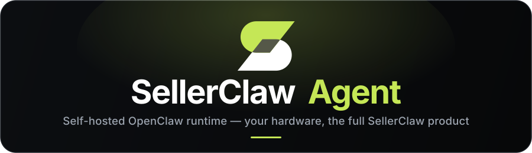

<div align="center">



<br/>
<br/>

[](LICENSE)
[](pyproject.toml)
[](docker-compose.yml)
[](https://github.com/sellerai-com/sellerclaw-agent/actions/workflows/build-image.yml)
[](https://github.com/openclaw/openclaw)

**Run the OpenClaw agent that powers SellerClaw on your own hardware — same web admin, your compute, outbound-only pairing.**

[Quick start](#quick-start) · [Why self-host](#why-sellerclaw-agent) · [Architecture](#architecture-overview) · [Docs](#documentation) · [Roadmap](ROADMAP.md)

<br/>

<a href="https://www.producthunt.com/products/sellerclaw?embed=true&utm_source=badge-top-post-badge&utm_medium=badge&utm_campaign=badge-sellerclaw" target="_blank" rel="noopener noreferrer"></a>

</div>

---

SellerClaw Agent is the self-hosted runtime for **[SellerClaw](https://sellerclaw.ai)** — the e-commerce platform built around OpenClaw.

It lets you run the OpenClaw agent that powers SellerClaw on your own computer or your own server, while everything you actually *do* — configure stores and suppliers, launch workflows, chat with the agent, review results — stays in the regular SellerClaw web admin panel at [sellerclaw.ai](https://sellerclaw.ai).

In other words, SellerClaw Agent moves only the runtime to your hardware. The product experience does not change.

## Install

```bash
curl -fsSL https://get.sellerclaw.ai/agent.sh | sh
```

That is the whole installation. The script checks the machine, installs Docker if it is missing, downloads the prebuilt runtime image, starts it, and prints a code to confirm in your browser — after which the agent is paired with your SellerClaw account. There is nothing to clone and nothing to build; the CLI, OpenClaw, the browser and `sellerclaw-cli` all live inside the image.

You need Docker-capable hardware with more than 2 GB of RAM, on Linux or macOS (x86_64 or Apple Silicon).

Then manage it with the `sellerclaw-agent` command:

```bash
sellerclaw-agent status     # is it connected to your account?
sellerclaw-agent logs       # follow what it is doing
sellerclaw-agent update     # move to the latest version
sellerclaw-agent uninstall  # remove it from this machine
```

Prefer to read before you run? `curl -fsSL https://get.sellerclaw.ai/agent.sh -o agent.sh`, read it, then `sh agent.sh`. Building the image from source is the contributor path — see [CLI reference](docs/cli.md).

Finally, open **Settings → Hosting** in the web panel and switch to self-hosted, so your tasks run on this machine.

> **Status:** SellerClaw Agent is already working and open for experimentation. The CLI and public wire contracts are stable; the internal structure continues to evolve.

## What SellerClaw Agent Is

SellerClaw consists of a web admin panel, backend APIs, and an OpenClaw-based agent runtime. By default, all three live in the SellerClaw Cloud and you simply log in and use them.

SellerClaw Agent changes one thing: it takes the agent runtime out of the cloud and runs it locally, paired with your SellerClaw account over an outbound HTTPS connection.

From a user's point of view this means:

- you still sign in at `sellerclaw.ai` and use the same web admin panel
- your stores, suppliers, products, orders, and workflows live in your SellerClaw account
- when an agent task runs, the actual browser, tools, and LLM calls happen on *your* machine
- nothing on your network needs to be exposed to the internet — the agent only makes outbound calls

Under the hood, SellerClaw Agent is a small, focused runtime wrapper. It packages OpenClaw, a local control-plane API, and an onboarding CLI into a single Docker image that you bring up with one command.

## Who It Is For

SellerClaw Agent is built for people who already want to use SellerClaw, but prefer to keep the agent runtime on hardware they own.

That includes:

- sellers and operators who want the agent running on their own desktop or home server
- dropshippers and store owners who would rather not pay for managed runtime hosting
- builders and hustlers running long-lived automations cheaply on a small VPS
- privacy-, residency-, or compliance-driven teams that need the runtime close to their data
- developers exploring the public agent protocol, the manifest contract, or self-hosted runtime extensions

It is **not** a standalone OpenClaw distribution. The agent is designed around a SellerClaw account — without one, there is nothing to drive it.

## Why SellerClaw Agent

Compared with using the default SellerClaw Cloud runtime, SellerClaw Agent is purpose-built for users who want to host the OpenClaw side themselves while keeping the rest of the SellerClaw product experience intact.

Key advantages include:

- **Same SellerClaw product, your hardware** — manage everything from the regular web admin panel; only the agent runtime moves
- **No managed-runtime hosting fee** — you bring the compute (a laptop, a desktop, a home server, a small VPS) and skip the hosting portion of a SellerClaw plan
- **Safe local execution** — the agent runs in Docker, with no access to the host system and no inbound network exposure
- **Outbound-only pairing** — no public IP, no port forwarding, no tunnels; the agent connects out to SellerClaw and pulls work
- **One-command onboarding** — a single `curl … | sh` pulls the prebuilt image, starts the runtime and signs you in; no checkout, no build, no Python on the host
- **Local control and inspection** — `sellerclaw-agent status`, container logs, and a documented HTTP control plane for checking the manifest and the OpenClaw runtime during installation and debugging
- **Open wire contracts** — the cloud connection protocol and the manifest format are public, so the runtime is inspectable and extensible

## Cloud Runtime and Self-Hosted Runtime

SellerClaw is available in two runtime modes:

- **Cloud-hosted runtime** — the default. The OpenClaw agent runs in the SellerClaw Cloud alongside the web admin panel and APIs. There is nothing to install: log in and use the product.
- **Self-hosted runtime** — what this repository provides. The web admin panel and APIs still live in the SellerClaw Cloud, but the OpenClaw agent runs on hardware you control. You install SellerClaw Agent once, sign in, and the agent pairs itself with your SellerClaw account.

Both modes use the same web admin panel, the same workflows, and the same agent capabilities. The choice is purely about *where* the agent runs.

## SellerClaw Agent + OpenClaw

SellerClaw Agent does not just start OpenClaw and walk away.

It makes the OpenClaw runtime usable as a piece of the broader SellerClaw product by adding:

- a manifest-driven boot — the SellerClaw Cloud sends a single JSON manifest that describes how this user's OpenClaw should be configured, and the agent renders it into a runtime bundle on demand
- a long-lived cloud pairing — agent-scoped tokens, automatic reconnection, command pull (start / stop / restart / disconnect) and result reporting
- Docker-isolated execution — OpenClaw, the local control plane, and the KasmVNC browser run in one container, supervised together
- one-command CLI onboarding — install, sign in, and start the runtime in a single step
- a bundled cloud tool layer — the public [`sellerclaw-cli`](https://github.com/sellerai-com/sellerclaw-cli) ships inside the runtime image, pre-authenticated with the agent token, so OpenClaw drives the SellerClaw cloud (stores, orders, listings, ads, suppliers, media) through it

In practice, SellerClaw Agent is the operational and packaging layer that makes the OpenClaw runtime a first-class self-hosted option for the SellerClaw product.

## Core Capabilities

SellerClaw Agent provides the building blocks needed to operate a self-hosted OpenClaw runtime as part of a SellerClaw account, including:

- one-command setup, sign-in, start, stop, and status from the CLI
- secure pairing with the SellerClaw Cloud over agent-scoped tokens
- automatic manifest sync and OpenClaw bundle rendering
- long-running ping / command loop with reconnection and recovery
- a local FastAPI control plane with a documented HTTP surface
- a combined Docker image that includes OpenClaw, the KasmVNC browser, and the agent server
- environment profiles for local, staging, and production SellerClaw clouds

New capabilities are added regularly. Contributions around onboarding, runtime observability, and manifest handling are particularly welcome — see the [roadmap](ROADMAP.md).

## Architecture Overview

At a high level, a self-hosted SellerClaw setup looks like this:

- the **SellerClaw Cloud** hosts the web admin panel, the backend APIs, the user's account, and the dispatch side of the agent connection
- **SellerClaw Agent** runs on the user's machine, pairs with the cloud over outbound HTTPS, holds the rendered OpenClaw configuration, and supervises the runtime
- **OpenClaw** runs inside the same Docker container as the agent, alongside a KasmVNC browser, and does the actual automation work

Inside that container, OpenClaw reaches the SellerClaw cloud through a bundled copy of [`sellerclaw-cli`](https://github.com/sellerai-com/sellerclaw-cli) — the same public command-line / MCP client anyone can install, here baked into the image and signed in automatically with the agent token. So a self-hosted setup has two distinct channels: the **control-plane pairing** (cloud dispatches commands, the agent reports results) and the **CLI tool calls** OpenClaw makes to read and change stores, orders, listings, ads, suppliers, and media.

End users never interact with the local agent directly. They work in the web admin panel at `sellerclaw.ai`, which routes commands and results through the cloud connection. The local FastAPI server exists for installation, sign-in, and host-side troubleshooting.

See the [cloud connection protocol](docs/connection-protocol.md) and the [agent manifest contract](docs/contracts/agent-manifest.md) for the wire details.

## Tech Stack

| Category | Technology |
|---|---|
| CLI | Python 3.12+, `rich`, `questionary`, `httpx` |
| Agent ↔ cloud tooling | [`sellerclaw-cli`](https://github.com/sellerai-com/sellerclaw-cli), bundled in the runtime image |
| Local control plane | FastAPI, uvicorn, Pydantic v2 |
| Agent runtime | OpenClaw, Node.js 20, KasmVNC, Playwright |
| Process supervision | supervisord |
| Packaging | Docker, Docker Compose |
| Tooling | uv |
| Quality | pytest, ruff, pyright |

## Running From Source (contributors)

Users install the released image with the one-liner at the top of this page. Building the runtime from this checkout is the contributor path — it compiles the image locally from `runtime/Dockerfile` instead of downloading it.

Prerequisites: Docker + Docker Compose v2, Python 3.12+, [uv](https://docs.astral.sh/uv/).

```bash
git clone https://github.com/sellerai-com/sellerclaw-agent.git
cd sellerclaw-agent
./setup.sh
```

This checks Docker, installs Python dependencies, builds and brings up the stack, and runs the interactive SellerClaw sign-in.

After startup the local control plane answers on `http://localhost:8001`.

For environment profiles, every CLI command, and common failure modes, see [CLI reference](docs/cli.md).

## Repository Structure

```text
sellerclaw_agent/       # Python package (CLI, server, cloud client, bundle renderer)
runtime/                # Dockerfile for the combined OpenClaw + agent image
tests/                  # unit and contract tests
docs/                   # public technical documentation
docker-compose.yml      # local stack (source build)
Makefile                # common tasks
install.sh              # what get.sellerclaw.ai/agent.sh serves — the user-facing installer
setup.sh                # contributor onboarding script (builds the image from this checkout)
```

## Documentation

Use the documentation based on what you want to do next:

- **[CLI reference](docs/cli.md)** — install SellerClaw Agent, set up environment profiles, sign in, and run the day-to-day commands
- **[Cloud connection protocol](docs/connection-protocol.md)** — how the agent pairs with the SellerClaw Cloud, heartbeats, pulls commands, and reports results
- **[Agent manifest contract](docs/contracts/agent-manifest.md)** — the wire format the SellerClaw Cloud uses to configure the OpenClaw runtime

A full index lives in [`docs/README.md`](docs/README.md).

## Contributing

Contributions are welcome. For details, see [CONTRIBUTING.md](CONTRIBUTING.md).

SellerClaw Agent is part of a growing ecosystem, and community contributions help expand it with better onboarding, stronger runtime diagnostics, more resilient cloud pairing, and a cleaner local experience.

When contributing, please:

- keep the agent independently installable — do not pull in the broader SellerClaw monolith
- preserve the public wire contracts (manifest, connection protocol) or version them deliberately
- update the relevant `docs/*` pages when public behavior changes
- run `make lint` and `make test_unit` before opening a pull request

## Security

If you believe you have found a vulnerability, please do **not** open a public GitHub issue. See [SECURITY.md](SECURITY.md) for the private reporting process.

## Related Projects

SellerClaw is split across a small family of repositories:

- **[sellerclaw-cli](https://github.com/sellerai-com/sellerclaw-cli)** — the public command-line client and MCP server for the SellerClaw cloud. The runtime image bundles it as the tool OpenClaw uses to reach the SellerClaw server; you can install the very same CLI yourself to drive your stores, orders, listings, ads, and suppliers from a terminal, scripts, or Claude.
- **SellerClaw Cloud** — the hosted web admin panel and backend APIs at [sellerclaw.ai](https://sellerclaw.ai), where you configure stores and suppliers, launch workflows, and review results.

## About SellerAI

SellerClaw Agent is developed by **SellerAI**, the team behind SellerClaw.

SellerAI builds AI infrastructure for e-commerce. SellerClaw is the company's flagship product, available both as a hosted Cloud experience and — through this project — as a self-hosted runtime that keeps the agent on hardware the user controls.

Learn more or get in touch:

- SellerClaw: [sellerclaw.ai](https://sellerclaw.ai)
- SellerAI website: [sellerai.com](https://sellerai.com)
- Contact: [hello@sellerai.com](mailto:hello@sellerai.com)

## License

SellerClaw Agent is open source under the **Apache License 2.0**. You are free to use, modify, and redistribute it — including for commercial and hosted/managed-service use — subject to the terms of the license.

See [LICENSE](LICENSE) for full terms and [NOTICE](NOTICE) for attribution.
